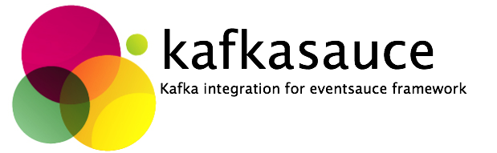

# About kafkasauce
**kafkasauce** is an integration module for [eventsauce](https://github.com/eventsauce/eventsauce)
that provides integration with the Kafka message passing platform.

## Contributions
If you wish to contribute to **kafkasauce** then please create an
issue to discuss the change or a pull request. Generally it's better
to raise an issue first, as unannounced pull requests may not
align to various long term goals. 

We're also working on improving documentation and examples, so watch this space.

## Code Quality & Standards
The **kafkasauce** project is hosted on GitHub, with CI builds by Travis-CI. 
All code submissions for core libraries are required to follow the airbnb ESLint
ruleset and have 100% coverage with mocha/chai tests. Pull requests that do not
pass the CI build or have untested code paths will be rejected.

## Licensing
Code is presently licensed as GPLv2, and may be used freely.  

